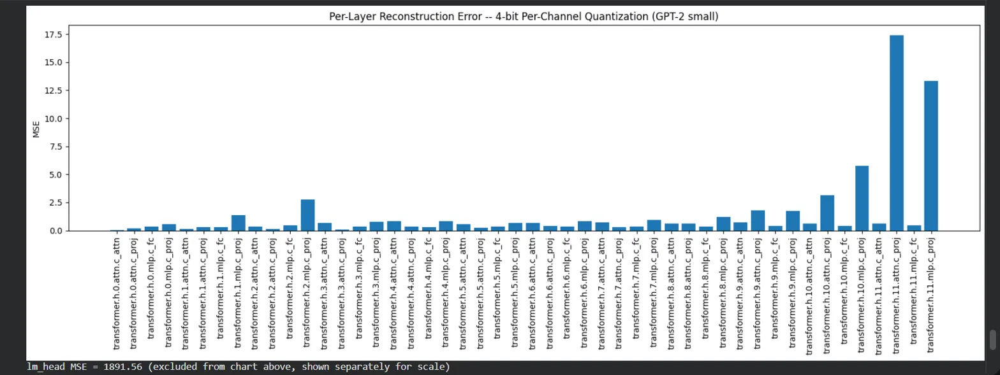

# GPT-2 Quantization Reconstruction Error

Measuring how much each layer's output changes when GPT-2's weights are compressed to 4-bit precision. A hands-on look at **per-layer reconstruction error** in LLM quantization.

## What this project does

1. Loads pretrained **GPT-2 small** (124M params) from HuggingFace.
2. Builds a **4-bit, per-channel quantization** function from scratch (no external quantization library). Each output channel (row) of a weight matrix gets its own scale, then values are rounded to 15 discrete levels and dequantized back to float.
3. Creates a quantized copy of the model by applying this function to every weight-bearing layer (`Linear` and GPT-2's `Conv1D` layers, 49 layers total).
4. Uses **forward hooks** to capture the real output activations of every layer, for both the original and the quantized model, using the same calibration input.
5. Computes the **Mean Squared Error (MSE)** between original and quantized outputs, layer by layer.
6. Visualizes the result to see which layers are most sensitive to quantization.

## Why this matters

Quantization shrinks a model's weights, but the real question is: **how much does that actually change what the model computes?** A weight can be rounded a lot and barely affect the output, or barely be rounded at all and still throw the output off significantly. Measuring *output* reconstruction error (rather than just weight error) shows which layers can be compressed aggressively, and which ones need to be handled more carefully.

## Setup

- **Model:** `gpt2` (GPT-2 small, HuggingFace `transformers`)
- **Calibration data:** 20 sample descriptions from the [`ag_news`](https://huggingface.co/datasets/ag_news) dataset
- **Quantization:** 4-bit, symmetric, per-channel (custom implementation)
- **Environment:** Google Colab

## Result

*(`lm_head` is excluded from this chart for scale. Its MSE was 1891.56, more than 100x larger than any other layer.)*

### Key findings

- **Error compounds with depth.** Early transformer blocks (layers 0–5) show low reconstruction error (mostly under 1.0 MSE). Later blocks (8–11) show significantly higher error, peaking at `transformer.h.11.attn.c_proj` (17.4 MSE).
- **Output projection layers (`c_proj`) are consistently the most sensitive**, especially in later blocks, more so than the `c_attn` and `c_fc` layers.
- **`lm_head` is by far the most fragile layer** in the entire model, with an MSE orders of magnitude higher than anything else. In practice, this is why many real-world quantization pipelines keep the final output layer at higher precision while compressing the rest of the model more aggressively.

## Project structure

The whole project is contained in a single Colab notebook, built step by step:

1. Setup & imports
2. Load GPT-2 small + tokenizer
3. Load `ag_news` and prepare calibration text
4. Write and test the 4-bit per-channel quantization function
5. Build a quantized copy of the model
6. Register forward hooks on both models
7. Run forward passes and capture activations
8. Compute per-layer MSE
9. Visualize results

## Possible extensions

- Compare 4-bit vs. 8-bit quantization error side by side
- Compare per-channel vs. per-tensor (single global scale) quantization
- Investigate *why* later layers and `c_proj` layers are more sensitive (e.g. inspect weight value distributions directly)
- Try a simplified AWQ-style approach: scale up "important" weight channels (based on activation magnitude) before quantizing
